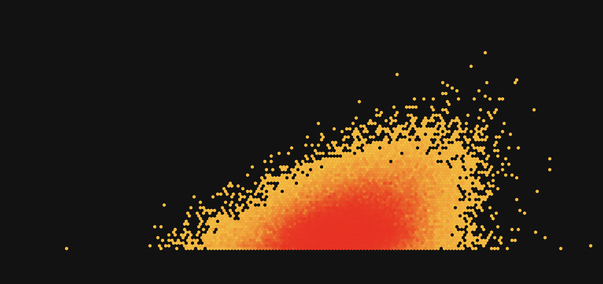

# scorigami

A web application written in TypeScript that fetches and displays a Scorigami chart, showcasing unique game scores. Scorigami is the phenomenon of achieving a final score in a sport that has never been seen before, highlighting rare and unprecedented score combinations.

## Leagues

- **NBA**

## Technologies

- **Frontend**: [React](https://github.com/facebook/react) with [MaterialUI](https://github.com/mui/material-ui)
- **Backend**: [NestJS](https://github.com/nestjs/nest) with [TypeORM](https://github.com/typeorm)
- **Database**: [PostgreSQL](https://www.postgresql.org)
